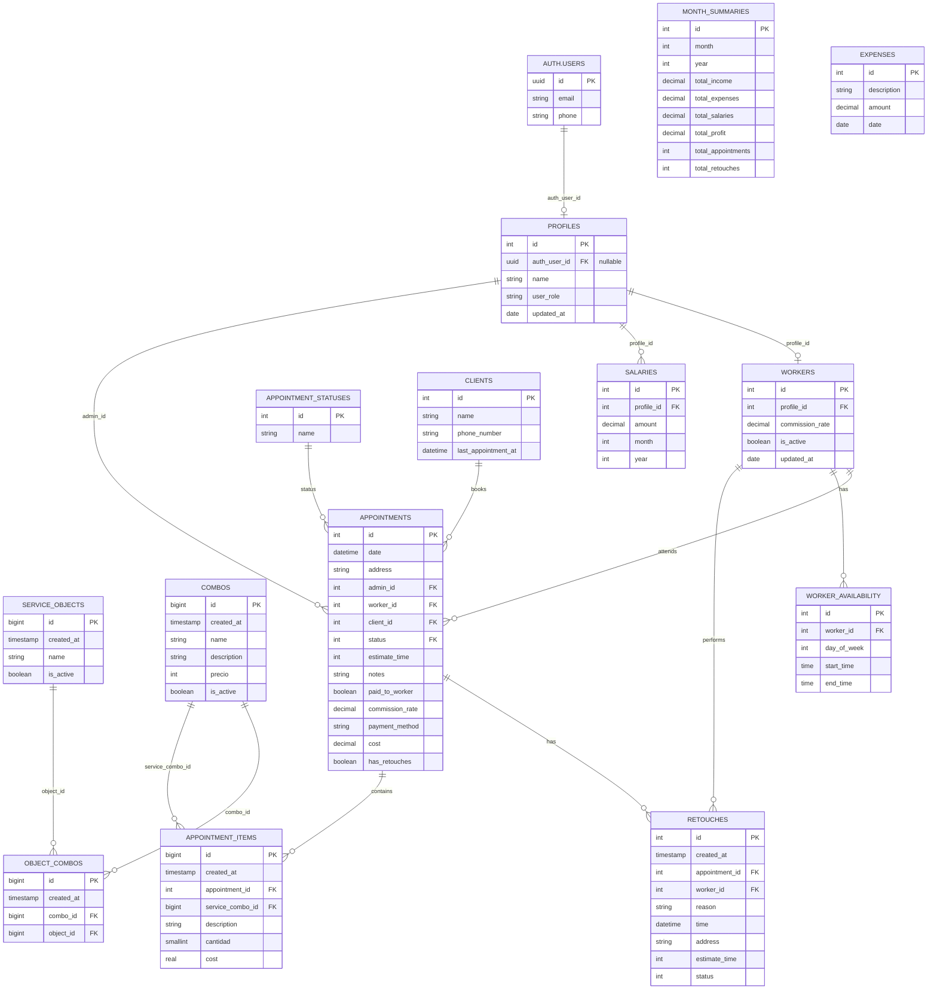

```mermaid
erDiagram
    
    AUTH.USERS {
        uuid id PK
        string email
        string phone
    }

    PROFILES {
        int id PK
        uuid auth_user_id FK "nullable"
        string name
        string user_role
        date updated_at
    }

    WORKERS {
        int id PK
        int profile_id FK
        decimal commission_rate
        boolean is_active
        date updated_at
    }

    SERVICE_OBJECTS {
        bigint id PK
        timestamp created_at
        string name
        boolean is_active
    }

    COMBOS {
        bigint id PK
        timestamp created_at
        string name
        string description
        int precio
        boolean is_active
    }

    OBJECT_COMBOS {
        bigint id PK
        timestamp created_at
        bigint combo_id FK
        bigint object_id FK
    }

    APPOINTMENT_ITEMS{
        bigint id PK
        timestamp created_at
        int appointment_id FK
        bigint service_combo_id FK
        string description
        smallint cantidad
        real cost
    }

    APPOINTMENT_STATUSES {
        int id PK
        string name
    }

    WORKER_AVAILABILITY {
        int id PK
        int worker_id FK
        int day_of_week
        time start_time
        time end_time
    }

    CLIENTS {
        int id PK
        string name
        string phone_number
        datetime last_appointment_at
    }

    APPOINTMENTS {
        int id PK
        datetime date
        string address
        int admin_id FK
        int worker_id FK
        int client_id FK
        int status FK
        int estimate_time
        string notes
        boolean paid_to_worker
        decimal commission_rate
        string payment_method
        decimal cost
        boolean has_retouches
    }

    RETOUCHES {
        int id PK
        timestamp created_at
        int appointment_id FK
        int worker_id FK
        string reason
        datetime time
        string address
        int estimate_time
        int status
    }

    MONTH_SUMMARIES {
        int id PK
        int month
        int year
        decimal total_income
        decimal total_expenses
        decimal total_salaries
        decimal total_profit
        int total_appointments
        int total_retouches
    }

    EXPENSES {
        int id PK
        string description
        decimal amount
        date date
    }

    SALARIES {
        int id PK
        int profile_id FK
        decimal amount
        int month
        int year
    }

    AUTH.USERS ||--o| PROFILES : auth_user_id
    PROFILES ||--o| WORKERS : profile_id
    WORKERS ||--o{ APPOINTMENTS : attends
    WORKERS ||--o{ WORKER_AVAILABILITY : has
    WORKERS ||--o{ RETOUCHES : performs
    CLIENTS ||--o{ APPOINTMENTS : books
    APPOINTMENT_STATUSES ||--o{ APPOINTMENTS : status
    APPOINTMENTS ||--o{ RETOUCHES : has
    SERVICE_OBJECTS ||--o{ OBJECT_COMBOS : object_id
    COMBOS ||--o{ OBJECT_COMBOS : combo_id
    COMBOS ||--o{ APPOINTMENT_ITEMS : service_combo_id
    PROFILES ||--o{ SALARIES : profile_id
    APPOINTMENTS ||--o{ APPOINTMENT_ITEMS : contains
    PROFILES ||--o{ APPOINTMENTS : admin_id
```
